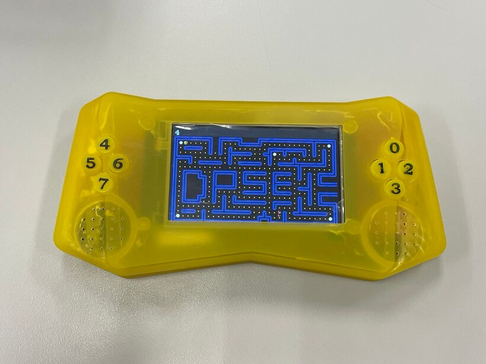
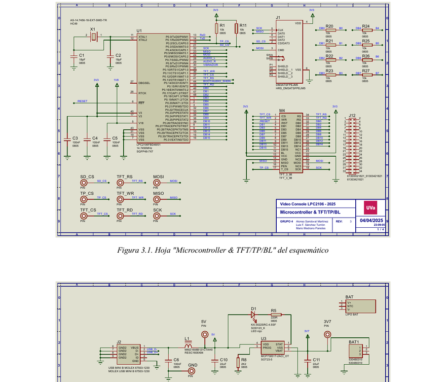
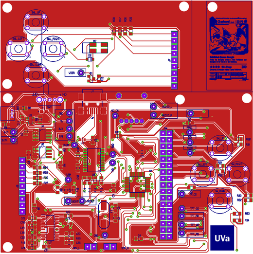
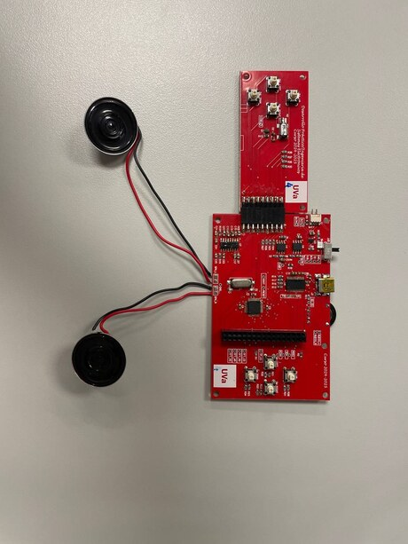
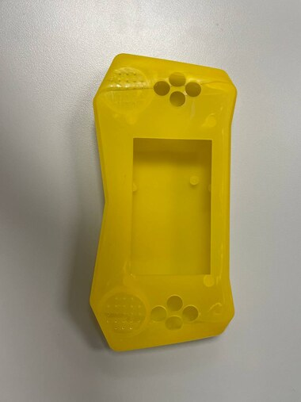

# DPSE — Portable Retro Game Console (LPC2106)

A handheld retro game console designed and built from scratch: from the schematic and a custom
PCB, through firmware written in C, to a 3D‑printed enclosure — running a hand‑coded port of the
classic **Pac‑Man** on an ARM7 microcontroller.

<p align="center">
  
</p>

<p align="center"><em>The finished console: 3D‑printed case, dual D‑pads, stereo speakers and a custom Pac‑Man maze that spells out “DPSE”.</em></p>

---

## What it is

This was an end‑to‑end electronics project that covers the entire product cycle of a small embedded
device. Everything you would expect from a real consumer gadget is here — power management, a
battery, a display, audio, haptics and a game — squeezed onto a compact, battery‑powered handheld
built around the **NXP LPC2106 (ARM7TDMI)** microcontroller.

The goal was to take a product from a blank page to a working prototype, touching every discipline
along the way:

- **Electronics design** — full schematic capture and a custom two‑part PCB
- **Electrical & thermal analysis** — current budgets per power rail and junction‑temperature checks
- **Manufacturing & assembly** — Gerber export, board fabrication and manual SMD soldering
- **Mechanical design** — a 3D‑printed (resin/SLA) enclosure with integrated buttons
- **Firmware** — bare‑metal C drivers for every peripheral
- **Software** — a complete, playable Pac‑Man written for the platform

> Built as a 3‑person engineering team project (Alonso Sandoval Martínez, Luis F. Sánchez Turrión,
> Mario Medrano Paredes).

---

## Hardware highlights

| Subsystem        | Implementation |
|------------------|----------------|
| **MCU**          | NXP LPC2106 (ARM7TDMI core, 14.7456 MHz crystal) |
| **Display**      | 800×480 TFT module (NT35510 controller) with a resistive **touch panel** (XPT2046 over SPI) |
| **Controls**     | Two D‑pads — 8 tactile buttons, multiplexed onto the TFT’s 16‑bit data bus |
| **Audio**        | Stereo Class‑D amplifier (PAM8403) driving two speakers, with a volume potentiometer |
| **Haptics**      | Vibration motor driven through a P‑channel MOSFET and one of the MCU timers |
| **Power**        | 2000 mAh Li‑Po battery, MCP73831 charge controller, USB Mini‑B input |
| **Regulation**   | MCP1725‑ADJ linear regulators generating the 3.3 V and 1.8 V rails, with USB/battery source‑select |
| **Programming**  | CY7C65213 USB‑to‑UART bridge for flashing the firmware via the bootloader |

A few engineering details worth calling out:

- **Test points on every rail and bus** (3V3, 1V8, 3V7, GND, data and control lines) so the board can
  be probed without touching component pins.
- **Worst‑case electrical analysis** grouped by voltage rail to size the regulators, input filter and
  copper trace widths.
- **Thermal analysis** using each part’s power dissipation and junction‑to‑ambient thermal resistance
  to verify safe operating temperatures.
- A **116‑part Bill of Materials** with supplier codes, totalling **≈ €67** in components.

<p align="center">
  
</p>
<p align="center"><em>Two of the four schematic sheets — the microcontroller/display block and the USB/power/battery block.</em></p>

<p align="center">
  
  
</p>
<p align="center"><em>Left: the routed top‑copper layout. Right: the populated board after hand‑soldering, with the two speakers attached.</em></p>

<p align="center">
  
</p>
<p align="center"><em>The resin‑printed enclosure (SLA), with cut‑outs for the screen, both D‑pads and the speaker grilles.</em></p>

---

## Firmware

The firmware is **bare‑metal C** built with the standard ARM7 GNU toolchain — no operating system.
It was developed and debugged against a microcontroller simulation model before being flashed to the
real hardware, which kept the test‑and‑fix loop fast during integration.

The codebase includes hand‑written low‑level drivers for each peripheral:

- **`NT35510.c`** — TFT display driver (init, fills, sprite/text rendering)
- **`xpt2046.c` / `calibrate.c`** — resistive touch‑panel readout and calibration
- **`audio.c`** — the audio engine (see below)
- **`vibrador.c`** — timer‑driven haptic motor control
- **`xpm.c`** — an XPM image/sprite renderer for the game graphics

### Audio engine

Sound is generated **entirely in software** using the LPC2106’s PWM peripheral:

- **4‑channel polyphonic** playback, mixed down to a stereo output.
- **Wavetable synthesis** — a 256‑sample sine table is read with a per‑channel phase accumulator;
  the increment sets each note’s frequency.
- The PWM carrier runs at **57.6 kHz** (10‑bit), while a separate timer interrupt (~128 ms) advances
  the music score note‑by‑note.
- Scores are stored as compact note arrays, so background music and sound effects share one engine.

### Vibration

A single timer (Timer 1) is loaded for the requested duration in milliseconds; its interrupt switches
the motor off and stops the timer — a clean one‑shot haptic pulse with no busy‑waiting.

---

## The game: Pac‑Man

A full Pac‑Man clone written specifically for this platform, with a few custom touches:

- **Custom maze** — the walls are laid out to spell **“DPSE”** in the middle of the board.
- **24×24‑pixel sprites** exported to the XPM format (Pac‑Man, the four ghosts in their different
  states and colours, coins, walls).
- **Smooth, flicker‑free movement** — characters animate pixel‑by‑pixel between tiles, restoring the
  background behind them and alternating Pac‑Man’s mouth as he eats.
- **Four ghosts** with staggered release from their pen and randomised pathfinding.
- **Power‑ups** that flip the ghosts into a vulnerable state, plus lives, a score HUD and win/lose
  conditions.
- **Haptic feedback** — the motor buzzes as each ghost is released into the maze.

The main loop runs continuously: read the buttons, update Pac‑Man and the ghosts, handle power‑up
mode, check collisions and redraw only what changed.

---

## Repository layout

```
.
├── Hardware/          # Proteus project, schematic PDF, BOM and Gerber/manufacturing files
├── Software/          # Firmware (LPC2106_1) — C drivers + the Pac-Man game — and bootloader tools
├── AnálisisTyE/       # Electrical & thermal analysis (current budgets, junction temperatures)
├── Planificacion/     # Project planning (Gantt chart)
├── Control de cambios/# Change-control / version logs kept through the build
└── Documentación/     # Full technical report (PDF)
```

---

## Tools & technologies

**Hardware:** Proteus (schematic capture + PCB layout), Gerber RS‑274X, PCBWay fabrication,
manual SMD soldering, resin (SLA) 3D printing.

**Firmware:** C, ARM7 (ARM7TDMI) bare‑metal, GNU toolchain, PWM audio synthesis, SPI, GPIO, ADC,
timer/interrupt‑driven peripherals.

---

## Status

Complete and working: the console boots, plays background music, reads the controls, renders the game
on the TFT and runs on battery power — a fully self‑contained, autonomous handheld.
